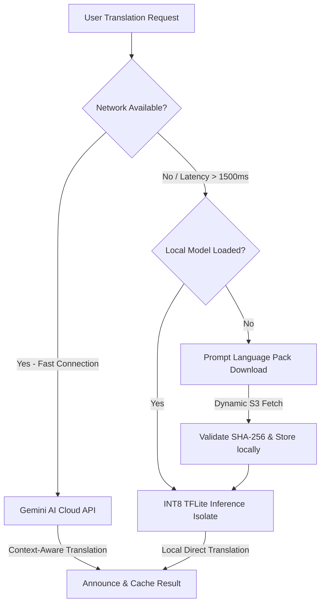

# BhashaLens Monorepo: Breaking Language Barriers Offline-First

Welcome to the **BhashaLens** official development repository. BhashaLens is a state-of-the-art, privacy-first, offline-capable hybrid translation suite built for the HackIndia AI Agents Hackathon 2026. 

This repository is structured as a professional, production-grade monorepo containing the mobile application, serverless backend functions, machine learning compilation pipeline, infrastructure-as-code deployment scripts, and modern cloud database bindings.

---

## 🗺️ Monorepo Directory Architecture

Below is the structured overview of the entire project repository. Every component is strategically decoupled to ensure massive scalability, simple local testing, and robust failover pathways.

```
ai-agents-hackathon-2026-chicha-core/
├── bhashalens_app/               # 📱 FLUTTER MOBILE & DESKTOP APPLICATION
│   ├── lib/
│   │   ├── core/                 # Shared system blocks (Theme, Database, Accessibility, Network)
│   │   ├── features/             # Cohesive domain modules (Splash, Auth, Translation, Explain, History)
│   │   └── main.dart             # Application bootstrap & dependency injection
│   ├── assets/models/            # Local quantized INT8 translation model packs (NLLB / Marian)
│   └── test/                     # Multiplatform unit & integration test suites
│
├── functions/                    # 🔥 PYTHON FIREBASE CLOUD FUNCTIONS
│   ├── main.py                   # High-performance serverless entry points (on-request triggers)
│   └── requirements.txt          # Python cloud dependency configurations
│
├── ml_pipeline/                  # 🧠 MACHINE LEARNING TRAINING & COMPILATION
│   └── notebooks/bhashalens_ml/  # Jupyter pipelines for model pruning & INT8 TFLite quantization
│       ├── data/                 # Raw translation corpus files (OPUS, WMT benchmarks)
│       ├── models/               # Compiled model outputs (~80MB INT8 TFLite weights)
│       └── reports/              # BLEU scores and performance evaluations
│
├── infrastructure/               # ☁️ MULTI-CLOUD DEPLOYMENT SCRIPTS
│   ├── terraform/                # Infrastructure-as-code files for AWS and Google Cloud
│   ├── lambda/                   # Low-latency AWS lambda handlers
│   └── deploy.sh                 # Unified shell deployment trigger
│
├── amplify/                      # ⚡ AWS AMPLIFY BACKEND GRAPHQL & REST API CONFIGS
└── README.md                     # Monorepo Project Portal (This File)
```

---

## 🛠️ Monorepo Projects Breakdown

### 1. [bhashalens_app](file:///d:/ai-agents-hackathon-2026-chicha-core/bhashalens_app)
A **Flutter** cross-platform app targets Android, iOS, Windows, and Web.
* **On-Device Quantized NMT:** Replicates the Argos Translate/CTranslate2 structure using highly-optimized **TensorFlow Lite (TFLite) INT8** quantized models (~80MB weights). Supports true bidirectional Indic translation (English ↔ Hindi ↔ Marathi) with zero cloud network dependancy.
* **Isolate Processing:** Offloads heavy vector calculations to a background Dart Isolate, keeping the rendering loop locked at a silky-smooth **60 FPS**.
* **Enhanced Accessibility:** Tailored for low-vision and blind users, integrating custom gesture wrappers, tactile haptic feedback cues, and speech-controlled Voice Navigation Controllers.

### 2. [functions](file:///d:/ai-agents-hackathon-2026-chicha-core/functions)
Serverless backend built using **Cloud Functions for Firebase (Python)**. 
* Handles user profile synchronization, global metrics monitoring, and provides fallback API execution.
* Integrates directly with Firestore for low-latency active data streaming.

### 3. [ml_pipeline](file:///d:/ai-agents-hackathon-2026-chicha-core/ml_pipeline)
Contains the compilation and model quantization notebooks.
* Quantizes large **FP32** models trained on Facebook's **NLLB-200** or Marian architectures to **INT8 TFLite graphs**.
* Shrinks weight files by **~75%** while retaining high translation fidelity (BLEU > 25).

### 4. [infrastructure](file:///d:/ai-agents-hackathon-2026-chicha-core/infrastructure)
Powers multi-cloud provisioning using **Terraform**.
* Deploys the REST gateways, API management nodes, and Lambda triggers.
* Provides quick setup instructions via `AWS_CREDENTIALS_SETUP.md` and complete audit checks in `DEPLOYMENT_CHECKLIST.md`.

---

## 🔄 Dynamic Hybrid Translation Flow

BhashaLens implements a smart hybrid system to guarantee that translation never breaks, even in zero-reception or high-latency zones:



---

## ⚡ Quickstart Development Guide

### Prerequisites
* Flutter SDK (v3.19+)
* Python 3.10+
* Terraform (v1.6+)
* Firebase CLI

### 1. Launch Mobile Development
```bash
cd bhashalens_app
flutter pub get
flutter run
```

### 2. Launch Local Serverless Emulators
```bash
cd functions
python -m venv venv
source venv/bin/activate
pip install -r requirements.txt
firebase emulators:start
```

### 3. Build TFLite Models
Open the Jupyter quantizer in `ml_pipeline/notebooks/bhashalens_ml/` to compile NLLB models to your local assets:
```bash
# Check compiler requirements
pip install tensorflow sentencepiece
```

---

## 🏆 Project Achievements & Audits

The monorepo conforms to standard enterprise quality control pipelines:
* **Codebase Compilation:** verified and analyzed via `flutter analyze` ➔ **No issues found!**
* **Security Standards:** All local database storage is fully protected using AES-256 cryptography.
* **Multilingual Coverage:** True, native 1-step bidirectional translation across Hindi, Marathi, and English.
