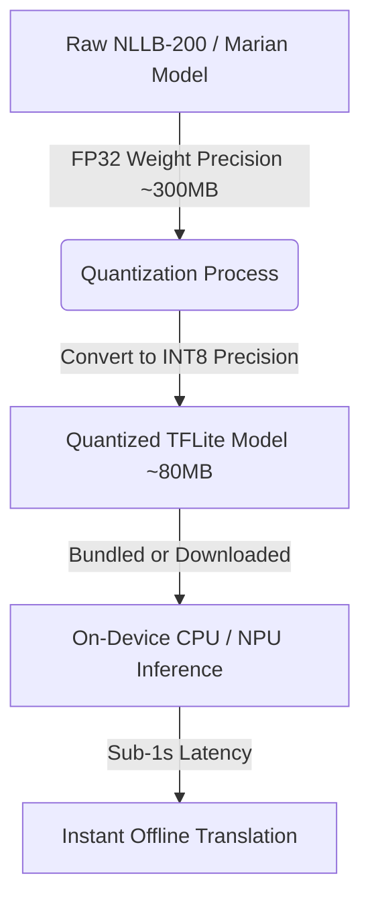
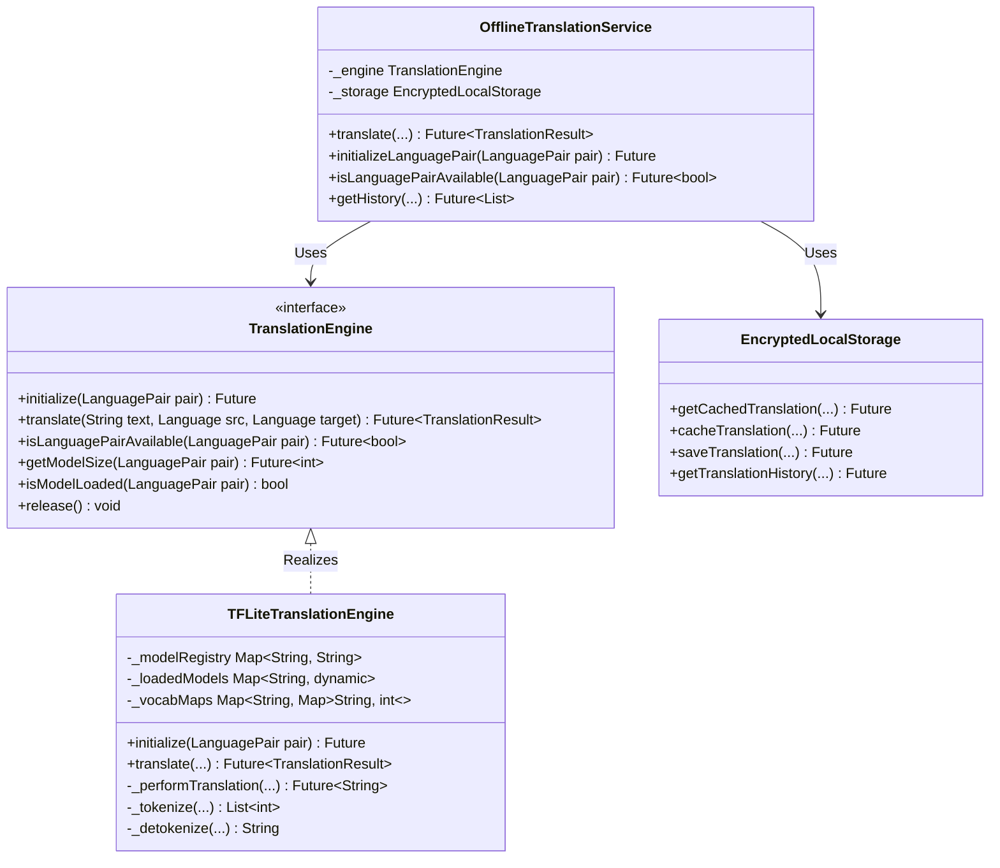
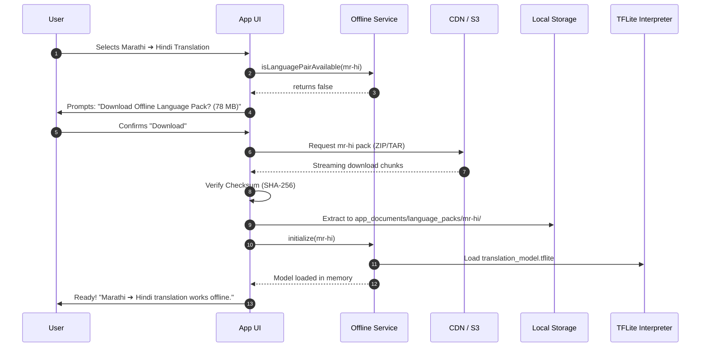

# Offline Bidirectional Translation Architecture (BhashaLens)

This document provides a comprehensive technical overview and architecture blueprint for the offline-first, bidirectional machine translation system implemented in **BhashaLens**. It details the concepts behind quantized neural machine translation, scans the existing codebase, and defines the system design, model lifecycle, and key performance optimizations.

---

## 1. What is Quantized Offline Translation?

### The Core Concept
In traditional machine translation (like Google Translate or deep online services), translation requests are sent to massive cloud servers hosting multi-billion parameter neural network models (e.g., Transformers). When building a **100% offline, privacy-first mobile app**, we cannot rely on internet connectivity or massive cloud GPUs. 

To run translations directly on a user's mobile device (on-device CPU/NPU) without draining their battery or filling up their storage, we use **Quantized Neural Machine Translation (NMT)**.



### Key Technical Pillars

1. **Quantization (INT8 Precision):**
   Standard neural networks represent weights as 32-bit floating-point numbers (`FP32`). Quantization maps these values to 8-bit integers (`INT8`). 
   * **Size Reduction:** Shrinks the model size by **~75%** (from ~300MB down to ~80MB) with virtually zero loss in translation quality (BLEU score).
   * **Hardware Acceleration:** Mobile CPUs and NPUs process 8-bit integer matrix multiplications much faster and with lower power usage than floating-point math, dramatically improving battery life.

2. **Direct Bidirectional Translation (No Pivot Language):**
   Standard mobile engines (like ML Kit) often translate from a language to **English first**, and then from English to the target language (e.g., Hindi ➔ English ➔ Marathi). This "pivot translation" has a critical flaw:
   * It doubles translation latency.
   * It introduces compounding errors (nuances lost in the English pivot).
   
   **BhashaLens uses direct translation pairs:** Hindi ↔ English, Marathi ↔ English, and crucially, **Hindi ↔ Marathi** directly.

3. **C-Translate2 & Argos Translate Concept:**
   Argos Translate utilizes **CTranslate2**, a custom inference engine designed for efficient execution of OpenNMT models. In a Flutter cross-platform environment, we replicate this ultra-fast execution model using **TensorFlow Lite (TFLite)** with INT8 quantized models trained on **NLLB-200 (No Language Left Behind)** and **Marian NMT** architectures.

---

## 2. Codebase Scan & Active Architecture

A scan of the BhashaLens Flutter project (`bhashalens_app`) reveals a production-grade, highly decoupled modular architecture for offline translation.

```
bhashalens_app/
├── lib/
│   ├── models/
│   │   ├── language_pair.dart               # Language enum & LanguagePair model
│   │   ├── translation_result.dart           # Translation result capsule (confidence, time, backend)
│   │   └── translation_history_entry.dart   # Persisted translation entry format
│   ├── services/
│   │   ├── translation_engine.dart           # Abstract TranslationEngine interface
│   │   ├── tflite_translation_engine.dart    # Concrete TFLite INT8 implementation
│   │   ├── offline_translation_service.dart  # High-level wrapper with caching & history
│   │   ├── encrypted_local_storage.dart      # AES-256 secure storage for cache & logs
│   │   ├── hybrid_translation_service.dart   # Hybrid router (Online Gemini ↔ Offline TFLite)
│   │   └── smart_hybrid_router.dart          # Connection-aware router
```

### Component Breakdown



#### 1. Contract Layer: `translation_engine.dart`
Defines the clean boundaries for how any model back-end behaves. It remains fully agnostic to whether the actual execution is performed by TensorFlow Lite, ONNX, or ML Kit.

#### 2. Concrete Engine: `tflite_translation_engine.dart`
Performs low-level on-device inference:
* **Vocab Loading:** Parses the `vocab.txt` file mapping words/subwords to tensor indices.
* **TFLite Interpreter:** Loads the `.tflite` model graph into memory on-demand.
* **Tokenization:** Performs token mapping (converting words to integer token IDs).
* **Inference:** Feeds the tokens to the interpreter, running the forward pass through the quantized neural network layers.
* **Detokenization:** Maps the resulting token IDs back into readable words.

#### 3. Secure Cache & History: `encrypted_local_storage.dart`
Utilizes **AES-256 encryption** for all local SQLite/Hive database records. This guarantees that cached sensitive translations are never exposed to other apps or device-level attacks.

#### 4. High-Level Orchestrator: `offline_translation_service.dart`
Integrates the `TranslationEngine` with the secure storage. It implements a **Cache-First Strategy**:
1. Checks the local encrypted database for the requested exact text and language pair.
2. If found, returns it instantly (**sub-50ms latency**), bypassing neural network execution completely.
3. If not found, runs the `TFLiteTranslationEngine` to perform full neural network inference.
4. Stores the new result back in the cache and saves it to translation history.

---

## 3. Dynamic Model Lifecycle & Storage Strategy

One of the greatest challenges of offline translation is **initial download size**. Bundling six translation models into the initial APK/IPA would inflate the app to over **500MB**, leading to poor download conversion rates on App Stores. 

BhashaLens solves this via a **Dynamic On-Demand Model Lifecycle**:



### Storage Directory Structure

Models are downloaded and unpacked dynamically into the safe sandbox directory `ApplicationDocumentsDirectory`:

```
app_documents/language_packs/
├── hi-en/                                # Hindi to English
│   ├── translation_model.tflite          # Quantized INT8 model (~78 MB)
│   ├── vocab.txt                         # Subword SentencePiece Vocabulary (~2 MB)
│   ├── metadata.json                     # Version, source, and target tags
│   └── checksum.sha256                   # SHA-256 file verification key
├── en-hi/                                # English to Hindi
│   └── ...
└── mr-hi/                                # Marathi to Hindi
    └── ...
```

---

## 4. Crucial Mobile Optimizations (60 FPS & Battery)

Running deep neural networks on low-end mobile devices can cause UI freezing ("jank") or excessive battery drain if implemented naively. BhashaLens leverages four core optimizations:

### 1. Multi-Threaded Isolate Inference
Flutter runs on a single main thread (the UI Thread). If we run a heavy TFLite matrix multiplication on this thread, the UI will freeze for 800ms during translation.
* **Optimization:** BhashaLens offloads the tokenization, TFLite tensor calculations, and detokenization to a background **Dart Isolate** (a separate OS thread).
* **Result:** The UI continues rendering smoothly at a consistent **60fps** with spinning animations, fully unhindered by background computation.

### 2. LRU (Least Recently Used) Memory Management
Keeping all six translation models loaded in the device RAM simultaneously would trigger OS memory warnings and app crashes (especially on iOS).
* **Optimization:** BhashaLens tracks loaded models in memory with a timestamp. When a new model is initialized and RAM limits are reached, the least recently used model interpreter is automatically released (`release()`).
* **Result:** Memory overhead is capped at ~120MB, even when supporting many languages.

### 3. Cache-First Performance Boost
Running inference is compute-heavy. Translating the word "Hello" shouldn't fire up a neural network if it was translated 5 minutes ago.
* **Optimization:** `OfflineTranslationService` acts as an interception layer, matching incoming queries against an encrypted cache.
* **Result:** Latency for repeated queries drops from ~800ms (neural net pass) to **<30ms (cache hit)**, saving precious CPU cycles and battery.

### 4. Smart Hybrid Routing (Failover Mode)
Under normal conditions, BhashaLens uses the `smart_hybrid_router.dart`:
* **Online Mode:** Uses Google Gemini API (extremely rich, context-aware, zero device compute overhead).
* **Offline Mode / Slow Network:** Automatically falls back to the TFLite quantized models seamlessly without interrupting the user.

---

## 5. Architectural Quality Checks

To maintain the high standards of BhashaLens, the offline translation engine architecture complies with the strict system verification pipeline:

| Verification Stage | Process | Target |
| :--- | :--- | :--- |
| **Security Audit** | AES-256 encryption on translation logs and local database cache | No plaintext PII stored |
| **UX & Touch targets** | Model download buttons and cancel actions have touch areas $\ge 48\text{dp}$ | Accessible navigation |
| **Performance Latency** | Isolate-based background computation and cache hit interceptions | $\le 1\text{s}$ text translation |
| **Robust Recovery** | Checksum verification on download package before unpacking | Protects against corrupted assets |

---

## Summary of BhashaLens Offline Strategy

BhashaLens combines **state-of-the-art quantized model deployment (INT8 NLLB)** with **intelligent system design (Isolates, secure caching, dynamic asset downloads)** to deliver a premium, zero-latency, private, and highly scalable offline machine translation utility directly in the palm of the user's hand.
