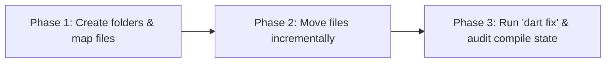

# BhashaLens App Architecture & Directory Structure Guide

This document defines the highly-optimized **Feature-First (Clean Domain) Architecture** for the **BhashaLens** Flutter application. It categorizes every single existing file, moves them from the clustered layer-based folders into cohesive domain-driven features, and sets the standard for scaling the application.

---

## 1. Current Architecture (Layer-First Clustered)
Currently, BhashaLens uses a traditional **Layer-First** folder structure:
* `lib/models/`: Holds all data structures for different features.
* `lib/services/`: Clusters 37 core operations (database, UI managers, machine learning, auth).
* `lib/pages/`: Clusters 21 views of different features in one directory.
* `lib/widgets/`: Clusters reuseable components.

### The Problem with Layer-First at Scale
As features grow (e.g., Explain Mode, Camera Translate, Voice Translate), developers must jump between folders to modify a single logical unit. For example, editing "Voice Translate" requires touching files in `lib/pages/voice_translate_page.dart`, `lib/services/voice_translation_service.dart`, and `lib/models/voice_command.dart`.

---

## 2. Target Architecture (Feature-First / Domain-Driven)

We organize code by **Feature** rather than by layer. Each feature forms a cohesive domain that contains its own data, service, and UI layer. Global resources go into the `core/` package.

```
lib/
├── core/                         # Global, shared resources & integrations
│   ├── database/                 # Secure storage and initialization
│   ├── theme/                    # Color systems, typography (AppTheme)
│   ├── accessibility/            # TalkBack, voice control, haptics services
│   ├── network/                  # AWS clients, general API utilities
│   └── errors/                   # Unified error handlers & pages
│
├── features/                     # Cohesive functional business domains
│   ├── splash_onboarding/        # Bootstrapping and onboarding
│   ├── auth/                     # Authentication & User Profiles
│   ├── home/                     # Landing screen and routing
│   ├── translation/              # Core NMT (Offline & Online)
│   ├── explain_simplify/         # Gemini explanation/simplification engine
│   ├── history_saved/            # SQLite translation history and bookmark services
│   └── settings/                 # App configurations & offline model downloads
│
└── main.dart                     # Entry point & Provider injection
```

---

## 3. Comprehensive File Mapping

Here is the exact mapping of **every file** in the BhashaLens workspace from its current clustered location to its proper architectural place.

### Category A: Core System (`lib/core/`)

| Current Location | Proper Architectural Placement | Purpose |
| :--- | :--- | :--- |
| `lib/theme/app_theme.dart` | `lib/core/theme/app_theme.dart` | Shared styling and colors |
| `lib/services/db_initializer.dart` | `lib/core/database/db_initializer.dart` | SQLite multi-platform setup |
| `lib/services/db_initializer_io.dart` | `lib/core/database/db_initializer_io.dart` | Desktop/Mobile database logic |
| `lib/services/db_initializer_web.dart` | `lib/core/database/db_initializer_web.dart` | Web database logic |
| `lib/services/db_initializer_stub.dart` | `lib/core/database/db_initializer_stub.dart` | Compilation stub |
| `lib/services/encrypted_local_storage.dart` | `lib/core/database/encrypted_local_storage.dart` | AES-256 local database wrapper |
| `lib/services/local_storage_service.dart` | `lib/core/database/local_storage_service.dart` | General shared preferences access |
| `lib/services/accessibility_service.dart` | `lib/core/accessibility/accessibility_service.dart` | Core OS accessibility check |
| `lib/services/enhanced_accessibility_service.dart` | `lib/core/accessibility/enhanced_accessibility_service.dart` | Text-to-speech, custom gesture listeners |
| `lib/services/audio_feedback/` (folder) | `lib/core/accessibility/audio_feedback/` | UI tap haptics & tone generator |
| `lib/services/voice_navigation/` (folder) | `lib/core/accessibility/voice_navigation/` | Accessibility voice route command mapping |
| `lib/services/aws_api_gateway_client.dart` | `lib/core/network/aws_client.dart` | Amplify AWS server integration |
| `lib/services/api_service.dart` | `lib/core/network/api_service.dart` | Basic REST client with retries |
| `lib/services/retry_policy.dart` | `lib/core/network/retry_policy.dart` | Linear/Exponential network retries |
| `lib/services/circuit_breaker.dart` | `lib/core/network/circuit_breaker.dart` | Server crash failover safety |
| `lib/services/monitoring_service.dart` | `lib/core/network/monitoring_service.dart` | Telemetry & performance logs |
| `lib/pages/error_fallback_page.dart` | `lib/core/errors/error_fallback_page.dart` | System crash page |

---

### Category B: App Features (`lib/features/`)

#### 1. Splash & Onboarding (`lib/features/splash_onboarding/`)
Responsible for bootstrap checks (Amplify load, Database sync) and intro screens.
* **UI Pages:**
  * `lib/pages/splash_screen.dart` ➔ `lib/features/splash_onboarding/presentation/pages/splash_screen.dart`
  * `lib/pages/onboarding_page.dart` ➔ `lib/features/splash_onboarding/presentation/pages/onboarding_page.dart`
* **Models:**
  * `lib/models/accessibility_settings.dart` ➔ `lib/features/splash_onboarding/data/models/accessibility_settings.dart`
  * `lib/models/audio_feedback_config.dart` ➔ `lib/features/splash_onboarding/data/models/audio_feedback_config.dart`

#### 2. Authentication (`lib/features/auth/`)
Handles user signup, login, password recovery, and Firebase Sync.
* **UI Pages:**
  * `lib/pages/auth/login_page.dart` ➔ `lib/features/auth/presentation/pages/login_page.dart`
  * `lib/pages/auth/signup_page.dart` ➔ `lib/features/auth/presentation/pages/signup_page.dart`
  * `lib/pages/auth/forgot_password_page.dart` ➔ `lib/features/auth/presentation/pages/forgot_password_page.dart`
* **Services:**
  * `lib/services/firebase_auth_service.dart` ➔ `lib/features/auth/domain/services/firebase_auth_service.dart`

#### 3. Home Screen (`lib/features/home/`)
The navigation hub for all core capabilities.
* **UI Pages:**
  * `lib/pages/home_page.dart` ➔ `lib/features/home/presentation/pages/home_page.dart`
  * `lib/pages/home_content.dart` ➔ `lib/features/home/presentation/widgets/home_content.dart`

#### 4. Translation Core (`lib/features/translation/`)
Manages text, camera/OCR, and voice translation (Online Gemini + Offline TFLite / ML Kit).
* **UI Pages:**
  * `lib/pages/text_translate_page.dart` ➔ `lib/features/translation/presentation/pages/text_translate_page.dart`
  * `lib/pages/camera_translate_page.dart` ➔ `lib/features/translation/presentation/pages/camera_translate_page.dart`
  * `lib/pages/voice_translate_page.dart` ➔ `lib/features/translation/presentation/pages/voice_translate_page.dart`
  * `lib/pages/translation_mode_page.dart` ➔ `lib/features/translation/presentation/pages/translation_mode_page.dart`
* **Services:**
  * `lib/services/translation_engine.dart` ➔ `lib/features/translation/domain/services/translation_engine.dart`
  * `lib/services/tflite_translation_engine.dart` ➔ `lib/features/translation/data/services/tflite_translation_engine.dart`
  * `lib/services/offline_translation_service.dart` ➔ `lib/features/translation/data/services/offline_translation_service.dart`
  * `lib/services/ml_kit_translation_service.dart` ➔ `lib/features/translation/data/services/ml_kit_translation_service.dart`
  * `lib/services/hybrid_translation_service.dart` ➔ `lib/features/translation/domain/services/hybrid_translation_service.dart`
  * `lib/services/smart_hybrid_router.dart` ➔ `lib/features/translation/domain/services/smart_hybrid_router.dart`
  * `lib/services/voice_translation_service.dart` ➔ `lib/features/translation/domain/services/voice_translation_service.dart`
* **Models:**
  * `lib/models/language_pair.dart` ➔ `lib/features/translation/data/models/language_pair.dart`
  * `lib/models/translation_result.dart` ➔ `lib/features/translation/data/models/translation_result.dart`
  * `lib/models/cached_translation.dart` ➔ `lib/features/translation/data/models/cached_translation.dart`
  * `lib/models/voice_command.dart` ➔ `lib/features/translation/data/models/voice_command.dart`

#### 5. Explain & Simplify (`lib/features/explain_simplify/`)
Powers the Gemini-based explanation mode (gives cultural context and dictionary definitions) and simplify mode (rephrases complex sentences).
* **UI Pages:**
  * `lib/pages/explain_mode_page.dart` ➔ `lib/features/explain_simplify/presentation/pages/explain_mode_page.dart`
  * `lib/pages/simplify_mode_page.dart` ➔ `lib/features/explain_simplify/presentation/pages/simplify_mode_page.dart`
  * `lib/pages/assistant_mode_page.dart` ➔ `lib/features/explain_simplify/presentation/pages/assistant_mode_page.dart`
* **Services:**
  * `lib/services/gemini_service.dart` ➔ `lib/features/explain_simplify/data/services/gemini_service.dart`
  * `lib/services/offline_explain_service.dart` ➔ `lib/features/explain_simplify/data/services/offline_explain_service.dart`
  * `lib/services/rule_engine.dart` ➔ `lib/features/explain_simplify/domain/services/rule_engine.dart`
* **Models / Data Templates:**
  * `lib/models/explanation_result.dart` ➔ `lib/features/explain_simplify/data/models/explanation_result.dart`
  * `lib/data/explanation_templates.dart` ➔ `lib/features/explain_simplify/data/explanation_templates.dart`

#### 6. History & Bookmarks (`lib/features/history_saved/`)
Stores offline translation histories and bookmarked favorites.
* **UI Pages:**
  * `lib/pages/history_page.dart` ➔ `lib/features/history_saved/presentation/pages/history_page.dart`
  * `lib/pages/saved_translations_page.dart` ➔ `lib/features/history_saved/presentation/pages/saved_translations_page.dart`
  * `lib/pages/history_saved_page.dart` ➔ `lib/features/history_saved/presentation/pages/history_saved_page.dart`
* **Services:**
  * `lib/services/history_service.dart` ➔ `lib/features/history_saved/domain/services/history_service.dart`
  * `lib/services/saved_translations_service.dart` ➔ `lib/features/history_saved/domain/services/saved_translations_service.dart`
  * `lib/services/firestore_service.dart` ➔ `lib/features/history_saved/data/services/firestore_service.dart`
  * `lib/services/export_service.dart` ➔ `lib/features/history_saved/domain/services/export_service.dart`
* **Models:**
  * `lib/models/translation_history_entry.dart` ➔ `lib/features/history_saved/data/models/translation_history_entry.dart`
  * `lib/models/saved_translation.dart` ➔ `lib/features/history_saved/data/models/saved_translation.dart`
  * `lib/models/history_item.dart` ➔ `lib/features/history_saved/data/models/history_item.dart`

#### 7. App Settings (`lib/features/settings/`)
Allows users to configure application settings, clean app cache, and download offline model packages.
* **UI Pages:**
  * `lib/pages/settings_page.dart` ➔ `lib/features/settings/presentation/pages/settings_page.dart`
  * `lib/pages/offline_models_page.dart` ➔ `lib/features/settings/presentation/pages/offline_models_page.dart`
  * `lib/pages/help_support_page.dart` ➔ `lib/features/settings/presentation/pages/help_support_page.dart`
  * `lib/pages/emergency_page.dart` ➔ `lib/features/settings/presentation/pages/emergency_page.dart`
* **Services:**
  * `lib/services/preferences_service.dart` ➔ `lib/features/settings/domain/services/preferences_service.dart`

---

## 4. Why This Architecture is Better

1. **High Cohesion:** All components belonging to a feature are placed in the same namespace, which reduces context switching.
2. **Simplified Refactoring:** If the "Voice Translate" model changes, all modifications are isolated to the `/features/translation/` directory without spilling into global model registries.
3. **Optimized Compilation & Tests:** Unit testing a feature becomes trivial since mock dependencies are confined to that specific domain.
4. **Decoupled Main Entry:** `main.dart` imports standard, high-level features rather than dealing with 50 individual file imports.

---

## 5. Physical Refactoring Execution Plan

> [!WARNING]
> Because BhashaLens is a live cross-platform Flutter application with multiple active developers, performing a bulk physical directory move directly in git can break compile states due to broken relative and package-level imports (e.g. `import 'package:bhashalens_app/pages/home_page.dart'`).

### Recommended Phase-based Migration Path

We highly recommend executing this migration in **3 controlled phases** using automated Dart tools:



1. **Step 1: Code Freeze**
   Ensure all active development branches are committed and merged.
2. **Step 2: Create Directory Structures**
   Initialize the clean directory structure (`core/`, `features/`).
3. **Step 3: Move Services to Core (`lib/core/`)**
   Move secure database files and network clients to `core/` first. Run `dart refactor` to auto-adjust dependencies.
4. **Step 4: Migrate Features Incrementally**
   Migrate features one by one (e.g., `auth` first, then `history_saved`, then `translation`). Compile and run test suites between each migration.
5. **Step 5: Main Entry Cleanup**
   Re-align `lib/main.dart` routes, and purge redundant files (e.g., remove `splash_page.dart` in favor of the animated `splash_screen.dart`).
