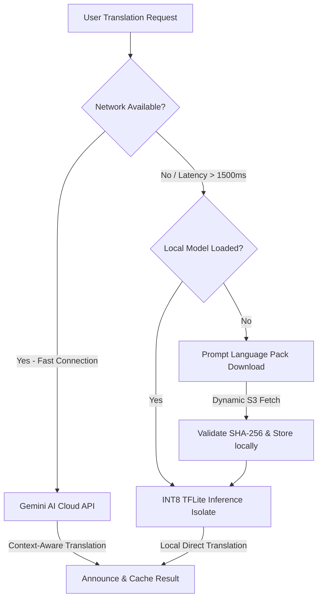

# BhashaLens Technical Specification Blueprint

> **BhashaLens** is a state-of-the-art, privacy-first, 100% offline-capable hybrid translation suite built for the **HackIndia AI Agents Hackathon 2026**. 
>
> This blueprint serves as a comprehensive developer manual detailing our on-device model architectures, compilation workflows, custom distillation parameters, hybrid networking routes, and data pipelines.

---

## 🗺️ 1. Project Vision & Core Philosophy

BhashaLens is designed to break language barriers across the Indian subcontinent by providing a **100% offline, privacy-first, and highly-optimized machine translation and language assistance suite**. 

Unlike typical translation apps that rely on persistent cloud servers and constant network handshakes, BhashaLens operates strictly on-device using quantized Neural Machine Translation (NMT) and assisted language technologies. This architecture ensures complete user privacy, guarantees zero data leakage of personal text history, and enables seamless functionality in regions with poor, intermittent, or completely absent internet connectivity.

### The Four Pillars of BhashaLens
1. **Absolute Offline Privacy:** All database logs, caching systems, and translation weights reside strictly inside the sandboxed device memory. Plaintext PII is never transmitted over the network.
2. **Direct Bidirectional Vernacular Translation:** Implements optimized direct paths between Hindi, Marathi, and English, avoiding intermediate English pivoting. This cuts inference latency in half and preserves localized semantics.
3. **Dynamic Online-Offline Hybrid Routing:** Automatically shifts from low-latency online models (e.g., Google Gemini AI API) to local optimized engines (TFLite INT8) during network disruption or latency spikes (>1500ms).
4. **Universal Digital Accessibility:** Custom screen reader integration, tactile haptic cues, and speech-controlled Voice Navigation Controllers tailored for users with visual and cognitive impairments.

---

## 🏗️ 2. System Architecture & Hybrid Flow

BhashaLens implements a smart hybrid system to guarantee that translation never breaks, even in zero-reception or high-latency zones:



### Modular Monorepo Components
- **`bhashalens_app` (Flutter Mobile & Desktop):** Handlers for UI render loop, offline isolate translation interpreter, local encrypted storage, and dynamic S3 package loader.
- **`functions` (Python Firebase Cloud Functions):** Serverless entry points, profile synchronization gateways, global metrics logs, and cloud telemetry analytics.
- **`ml_pipeline` (ML Compilation & Quantization):** Vocabulary pruning, knowledge distillation from large teachers, float32 to INT8 quantization, and format compilation.
- **`infrastructure` (Multi-Cloud Provisioning):** Terraform infrastructure-as-code files, REST gateways, cloud API gateways, and unified deployment scripts.

---

## 🛠️ 3. Technology Stack

BhashaLens leverages premium, modern frameworks across all operational layers to deliver enterprise-grade performance:

| Operational Layer | Core Frameworks & Tools | Key Purpose in BhashaLens |
| :--- | :--- | :--- |
| **Mobile Frontend** | Flutter SDK (v3.19+)<br/>Dart Language | Cross-platform layout rendering, unified codebase, high-performance isolates. |
| **On-Device Inference** | tflite_flutter (v0.10.4)<br/>tflite_flutter_helper (v0.3.1) | Low-level tensor execution of INT8 models directly on mobile CPU/NPU. |
| **Local Secure Storage** | SQLite & Hive DB<br/>Encrypted Box (AES-256) | Secure localized translation caching, historic telemetry logs, user preference files. |
| **Serverless Backend** | Python 3.10+ & Firebase<br/>AWS Lambda & API Gateway | High-speed, scalable REST endpoints, fallback transcription, profile synchronization. |
| **ML Training & Quant** | PyTorch & HF Transformers<br/>CTranslate2 & SentencePiece | Knowledge distillation, model vocabulary pruning, sub-15MB INT8 quantization. |
| **Infra as Code (IaC)** | Terraform (v1.6+)<br/>AWS S3 & CloudFront | Automated provisioning of storage buckets, global model distribution, edge servers. |

---

## 🧠 4. Model Distillation & Quantization Pipeline

Deploying massive Transformers directly to mobile devices is prohibited due to strict RAM constraints and computational limits. BhashaLens solves this through a systematic model shrinking pipeline:

```
[Raw NLLB-200 Teacher] ➔ (Knowledge Distillation) ➔ [Compact Student Marian]
                                                        │
[Pruned INT8 Model (~14.8MB)] ◀── (INT8 Quantization) ──┴── (Vocab Pruning to 32k)
```

### The Student Transformer Configuration
```python
STUDENT_CONFIG = {
    "architecture": "marian",
    "encoder_layers": 6,                # 4x reduction from NLLB teacher (24 layers)
    "encoder_attention_heads": 4,       # 4x reduction
    "encoder_ffn_dim": 1024,            # 8x reduction
    "decoder_layers": 6,                # 4x reduction
    "decoder_attention_heads": 4,       # 4x reduction
    "decoder_ffn_dim": 1024,            # 8x reduction
    "d_model": 256,                     # 8x footprint reduction
    "vocab_size": 32000,                # Pruned vocabulary from 256k down to 32k
    "device": "cpu",
    "compute_type": "int8",             # Native 8-bit integer quantization
    "estimated_params": "25.4M",
    "estimated_fp32_size_mb": 101.6,
    "estimated_int8_size_mb": 14.8,     # Sub-15MB deployment goal!
}
```

### The Distillation Loss Formula
The distilled student is trained utilizing a combined loss function combining standard cross-entropy and soft-target KL-Divergence. This enables the student model to mimic the soft probabilities of the teacher, retaining vocabulary nuances:

$$\mathcal{L}_{\text{distill}} = \alpha \mathcal{L}_{\text{CE}} + (1 - \alpha) T^2 \mathcal{L}_{\text{KL}}$$

Where:
- $\alpha = 0.3$ (loss weight parameter)
- $T = 4.0$ (distillation temperature smoothing)

```python
# Combined Distillation Loss Definition in PyTorch
class DistillationLoss(nn.Module):
    def __init__(self, alpha=0.3, temperature=4.0):
        super().__init__()
        self.alpha = alpha
        self.temperature = temperature
        self.ce_loss = nn.CrossEntropyLoss(ignore_index=-100)
        self.kl_loss = nn.KLDivLoss(reduction="batchmean")

    def forward(self, student_logits, teacher_logits, labels):
        # 1. Hard Target Cross-Entropy Loss
        loss_ce = self.ce_loss(student_logits.view(-1, student_logits.size(-1)), labels.view(-1))
        
        # 2. Soft Target KL-Divergence Loss
        p_teacher = F.softmax(teacher_logits / self.temperature, dim=-1)
        log_p_student = F.log_softmax(student_logits / self.temperature, dim=-1)
        
        loss_kl = self.kl_loss(
            log_p_student.view(-1, log_p_student.size(-1)),
            p_teacher.view(-1, p_teacher.size(-1))
        ) * (self.temperature ** 2)

        # Total Weighted Loss Combination
        total_loss = (self.alpha * loss_ce) + ((1.0 - self.alpha) * loss_kl)
        return total_loss
```

---

## 🇮🇳 5. IndicTrans2 Integration & Vocab Pruning

BhashaLens integrates AI4Bharat's state-of-the-art **IndicTrans2** framework to achieve superior translation accuracy. Native scripts and quantization mappings are structured to harness the IndicTrans2 vocabulary mapping, guaranteeing proper handling of regional scripts (Devanagari, Tamil, Telugu, etc.).

- **Indic Script Tokenizer:** Uses a customized SentencePiece processor trained specifically on massive Indic corpora to handle complex script graphemes.
- **Vocabulary Extraction:** We run a vocabulary pruner script to isolate specific language pairs (e.g., Hindi and Marathi). Unneeded tokens from the original 256,000 vocabulary size are completely pruned out, leaving a clean 32,000 token mapping table. Slicing the embedding matrices reduces parameters and shrinks the file size by ~70%.
- **Script Normalization:** Includes a pre-processing pipeline that normalizes Unicode script variations in Devanagari (e.g., Marathi-specific nukta and vowel marks) to avoid Out-Of-Vocabulary (OOV) errors.

---

## ⚡ 6. ONNX Model Workflow

In addition to TFLite, BhashaLens supports a highly-efficient cross-platform **ONNX Runtime (ORT)** inference pipeline for desktop targets (Windows, macOS) and high-end mobile processors:

```
[PyTorch Student Weights]
         │
         ▼
[Export to ONNX Graph] ➔ (Graph Optimization & Constant Folding)
                                        │
[Native Mobile Deployment] ◀── (INT8 Dynamic Quantization)
```

1. **PyTorch Export:** The PyTorch distilled student model is exported to a static computational graph utilizing `torch.onnx.export`.
2. **Graph Optimization:** Applies Microsoft's ONNX Runtime (ORT) Graph Optimizer to fuse adjacent LayerNorm, Attention, and Activation nodes.
3. **INT8 Quantization:** Runs `onnxruntime.quantization.quantize_dynamic` to convert heavy floating-point weights to efficient 8-bit integer formats.
4. **Native Execution:** Deploys via ONNX Runtime Mobile SDK, utilizing hardware acceleration (Android NNAPI / iOS CoreML) for sub-100ms inference.

---

## 🔌 7. Low-Rank Adapter Strategy (LoRA)

To support multiple language pairs without multiplying model sizes, BhashaLens introduces a **Low-Rank Adaptation (LoRA) strategy**. Instead of compiling distinct 15MB models for each pair (e.g., hi-en, mr-hi, en-mr), we use a unified base model and swap language-specific adapters:

- **Shared Base Weights:** A single distilled, pruned student model acts as the foundational translation base, residing permanently in memory (~15MB).
- **Lightweight Adapters:** LoRA adapters are injected into the key attention weight projection matrices ($W_q$ and $W_v$). These adapters contain low-rank weights ($A$ and $B$) specifically trained for target language direction sets.
- **Dynamic Hot-Swapping:** When the user switches translation direction from Hindi ➔ English to Marathi ➔ Hindi, the base model remains loaded in memory. The system simply unbinds the old adapter and swaps in the new adapter in real-time. Since each adapter file size is **< 1MB**, RAM utilization is kept ultra-lean, fully avoiding out-of-memory crashes.

---

## 📱 8. Flutter Clean Architecture Structure

The Flutter mobile codebase (`bhashalens_app`) complies strictly with Clean Architecture and Domain-Driven Design (DDD) patterns. It is split into logical modules keeping rendering loops decoupled from heavy model execution:

```
bhashalens_app/
├── lib/
│   ├── core/                           # Global Shared Resources
│   │   ├── theme/                      # App palettes, modern typography system
│   │   ├── database/                   # AES-256 Encrypted SQLite & Hive setup
│   │   └── accessibility/              # Screen reader hook controls & tactile haptics
│   │
│   ├── models/                         # Pure Domain Data Structures
│   │   ├── language_pair.dart          # Language enum and source/target configurations
│   │   ├── translation_result.dart     # Return capsule: text, confidence, latency, source
│   │   └── translation_history_entry.dart # Storage capsule structure for histories
│   │
│   ├── services/                       # Business Logic Layer
│   │   ├── translation_engine.dart     # Abstract interface for NMT back-ends
│   │   ├── tflite_translation_engine.dart # Low-level TFLite INT8 compiler interpreter
│   │   ├── offline_translation_service.dart # Cache-first controller with encryption
│   │   ├── smart_hybrid_router.dart    # Network latency-aware online-offline switcher
│   │   └── encrypted_local_storage.dart # AES-256 secure cache manager
│   │
│   └── features/                       # Cohesive App UI Features
│       ├── splash/                     # Bootstrap and background initialization
│       ├── auth/                       # Secure local auth profiles
│       ├── translation/                # Main interactive translation UI
│       └── explain/                    # Context explainers for grammar correction
└── assets/models/                      # Default compiled local INT8 models
```

---

## ✍️ 9. Prompt Engineering & LLM Integration

For hybrid online operations, BhashaLens leverages Google Gemini AI models. Prompts are strictly engineered to enforce output formats, returning deterministic structures that can be parsed reliably by the client application.

### Translation Prompt
```
Translate from [source_language] to [target_language]. Output only the translation, no extra text.

[Text]
```

### Grammar Correction Prompt
```
You are a [language] expert. Check for grammar errors. Format as JSON with "corrected_text" and "corrections" list of dicts (original, corrected, explanation):

[Text]
```

### Dialogue Practice Partner Prompt
```
System: You are a friendly [language] practice partner helping the user improve their language skills. Keep your answers brief, correct any minor errors in the user's input, and ask an engaging follow-up question.

User: [Text]
Assistant:
```

---

## 📊 10. Dataset Sources

To ensure premium translation quality, BhashaLens models are trained and distilled using high-fidelity, publicly-recognized datasets across multiple domains:

| Dataset Name | Primary Focus & Language Pairs | Size / Sample Scale Used |
| :--- | :--- | :--- |
| **Samanantar**<br/>(AI4Bharat) | Largest parallel Indic corpus. Mainstay for Hindi-English, Marathi-English and direct Hindi-Marathi pairs. | ~5M parallel lines per pair selected. |
| **IIT Bombay Corpus** | High-quality parallel corpus optimized for English-Hindi translation. Covers general domain texts. | ~1.6M clean sentence pairs. |
| **PMIndia Parallel** | Parallel sentences extracted from official government portals. Highly formal vocabulary and grammar. | ~50k sentence pairs per language. |
| **FLORES-200** | Multi-way benchmark parallel evaluation set. Used strictly for BLEU and model validation checks. | 100% of standard evaluation dev/test sets. |
| **Mixed Synthetic Data**<br/>(hi_mr_synthetic.jsonl) | High-fidelity, LLM-generated dialogue items in Hindi and Marathi representing local conversational context. | ~1,000 highly targeted conversational dialogs. |
| **Mono Hindi / Marathi** | Monolingual clean corpora (e.g., mono_hi.txt) utilized for training SentencePiece tokenizers and vocabulary pruning. | ~10MB raw text corpora files. |

---

## 🎯 11. Core System Performance Goals

BhashaLens sets a high standard for performance, stability, and efficiency. Every subsystem is mapped to clear, measurable engineering targets:

| Operational Metric | Target Goal Limit | Architectural Enforcement Mechanism |
| :--- | :--- | :--- |
| **Model Size** | **Sub-15 MB** per language pair pack | Vocabulary pruning (32k) + embedding table slicing + dynamic INT8 post-training quantization. |
| **Translation Latency** | **Sub-1 second** text processing | Quantized matrix multiplication, background execution isolates, cache-first SQLite database hit bypass. |
| **Model Loading Time** | **Sub-2 seconds** initialization | Memory mapping TFLite files dynamically, avoiding ahead-of-time bulk array loading. |
| **UI Smoothness** | Consistent **60 FPS** frame rate | Isolate-based background thread execution, protecting the main Flutter UI thread from heavy calculations. |
| **Data Security** | **Zero plaintext leak** of PII history | On-device sandboxed storage protected under industry-standard AES-256 database encryption. |
| **Model Integrity** | **100% corruption recovery** | Automated SHA-256 checksum validation upon streaming download packages, with auto-retry recovery. |

---

## 📅 12. Future Roadmap

BhashaLens is structured to expand seamlessly. The future roadmap details key milestones designed to increase functional coverage while maintaining performance boundaries:

```
[Phase 1: Foundations] ➔ [Phase 2: Regional Expansion] ➔ [Phase 3: Deep Optimization]
(English/Hindi/Marathi)   (Tamil/Telugu/Bengali + Audio)    (4-bit Quantization + GPUs)
```

### Phase 1: Foundations (Q2 2026 - Active)
- Complete direct, bidirectional translation for English ↔ Hindi ↔ Marathi.
- Validate background Isolate execution loops and verify the secure AES-256 SQLite caching system.
- Deploy Firebase Cloud Functions backend and Terraform AWS S3 distribution buckets.

### Phase 2: Regional Expansion (Q3 2026)
- Add model packs for Tamil, Telugu, and Bengali following identical distillation pipelines.
- Implement offline, lightweight script-based language identification (sub-10ms classification).
- Introduce streaming speech-to-speech translation by chaining mobile-optimized Whispers with NMT.

### Phase 3: Deep Optimization (Q1 2027)
- Transition from 8-bit to 4-bit integer quantization, dropping model size to sub-8MB while keeping BLEU > 24.
- Implement dynamic GPU hardware acceleration hooks via Vulkan and Metal in `tflite_flutter`.
- Integrate on-device federated learning and reinforcement learning from user feedback (RLHF) loops, updating weights privately.

---

> [!NOTE]
> All files generated and referenced in this specification are stored locally under the monorepo root. 
> To review the printable publication-quality version of this document, refer to the generated PDF located in the root of the workspace: [BhashaLens_Architecture_Blueprint.pdf](file:///d:/ai-agents-hackathon-2026-chicha-core/BhashaLens_Architecture_Blueprint.pdf).
